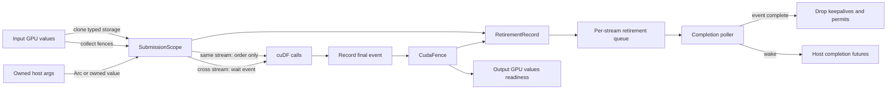
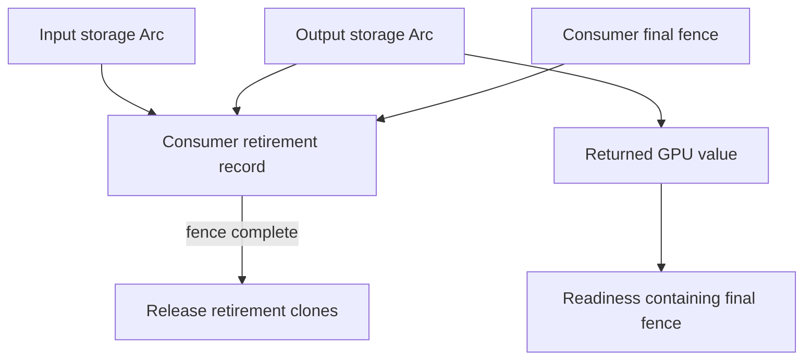
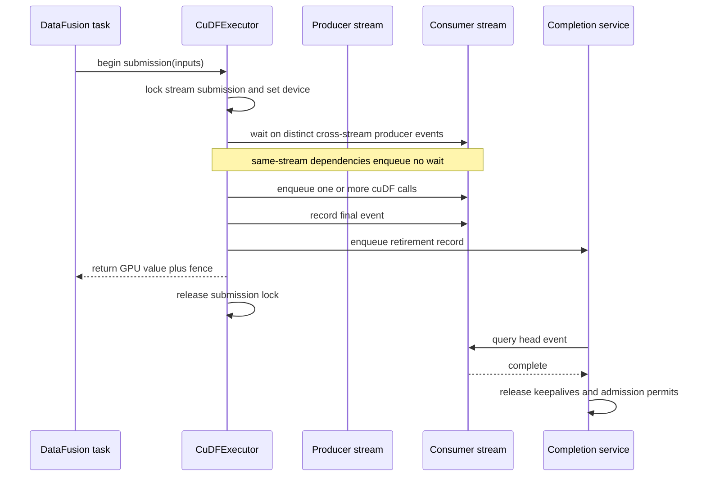
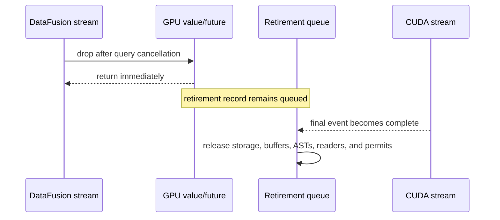
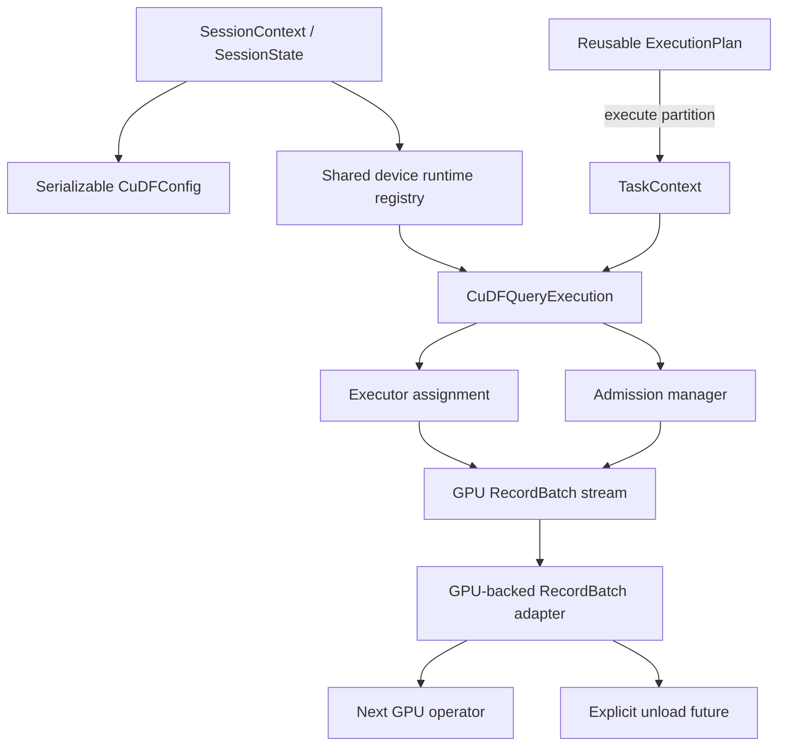
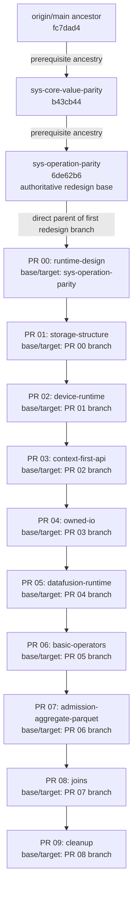
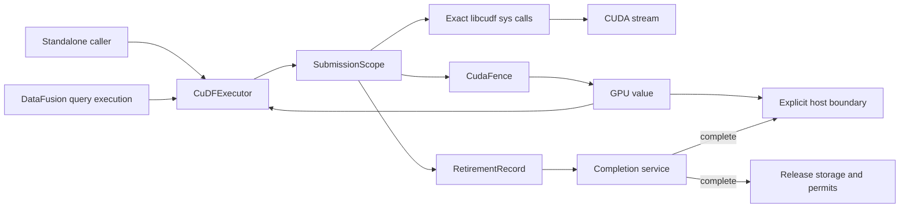

# Stream Runtime Redesign and Pull Request Plan

## Status

This document is a design and implementation plan. It does not describe the
implementation currently checked out in the working tree.

The only code baseline used for the repository analysis in this document is:

| Item | Value |
| --- | --- |
| Branch | `gene.bordegaray/2026/07/sys-operation-parity` |
| Commit | `6de62b63bc976d675032c1d333fedd82d25e3609` |
| Parent | `b43cb443d4163ca5bfab1f5de4c65cd712f77c7e` |
| Commit subject | `refactor: align operation bindings with cuDF` |
| cuDF source used by the build | `cudf-26.02.01` |
| DataFusion dependency | `53` |
| Arrow dependency | `58` |

All repository claims were obtained from the base commit with commands such as:

```bash
git ls-tree -r --name-only gene.bordegaray/2026/07/sys-operation-parity
git show gene.bordegaray/2026/07/sys-operation-parity:src/lib.rs
git show gene.bordegaray/2026/07/sys-operation-parity:src/config.rs
git show gene.bordegaray/2026/07/sys-operation-parity:libcudf-datafusion/src/physical/hash_join.rs
```

The current `root-execution-readiness-core` branch and the earlier `00` through
`10` prototype stack are not treated as committed architecture. They are useful
experiments from which individual tests or implementation lessons may be
reapplied, but they must not silently define the new public API or ownership
model.

### Baseline ancestry and PR targets

The redesign stack is **not based directly on the local `main` branch**. In this
checkout, local `main` is `cb10385` and is not an ancestor of the parity stack.
The actual lower ancestor is `origin/main` at `fc7dad4`, followed by two
prerequisite parity branches:

```text
origin/main (fc7dad4)
  -> sys-core-value-parity (b43cb44)
    -> sys-operation-parity (6de62b6)
      -> 00-runtime-design
        -> 01-storage-structure
          -> 02-device-runtime
            -> ...
```

The first redesign branch must still be created from
`gene.bordegaray/2026/07/sys-operation-parity`, not from `main` and not from the
current `root-execution-readiness-core` branch. On GitHub, PR 00 targets
`sys-operation-parity`; PR 01 targets PR 00's branch; every later PR targets the
preceding redesign branch. After the two parity branches merge into `main`, the
redesign stack can be rebased and its PR bases retargeted without changing this
logical dependency order.

## Source of truth

For every `libcudf-sys` change, the exact headers downloaded by the base build
are authoritative. Locate them with:

```bash
find target/ -type d -name "cudf-*" \
  | grep -E "cudf-[0-9]+\.[0-9]+\.[0-9]+$" \
  | head -1
```

For this baseline the result is `cudf-26.02.01`. Live documentation is useful
for explaining the design, but it cannot override those local declarations.
The relevant upstream principles are:

- libcudf APIs must be treated as asynchronous. Host return does not imply
  stream completion, and callers must preserve host and device lifetimes until
  stream-ordered accesses finish.
- APIs that execute kernels or allocate output memory accept an explicit
  `rmm::cuda_stream_view` and, where appropriate, an
  `rmm::device_async_resource_ref`.
- `cudaEventRecord` captures preceding work on a stream,
  `cudaStreamWaitEvent` introduces a device-side dependency, and
  `cudaEventQuery` observes completion without blocking the calling thread.
- A DataFusion `ExecutionPlan` produces a lazy, incremental
  `SendableRecordBatchStream`; cancellation occurs by dropping that stream, and
  the stream is `Send`.

References:

- [libcudf C++ developer guide](https://docs.rapids.ai/api/libcudf/stable/developer_guide)
- [CUDA event management](https://docs.nvidia.com/cuda/cuda-runtime-api/group__CUDART__EVENT.html)
- [CUDA stream management](https://docs.nvidia.com/cuda/cuda-runtime-api/group__CUDART__STREAM.html)
- [DataFusion 53 physical plan module](https://docs.rs/datafusion/53.0.0/datafusion/physical_plan/)
- [DataFusion ExecutionPlan](https://docs.rs/datafusion/latest/datafusion/physical_plan/trait.ExecutionPlan.html)
- [DataFusion SendableRecordBatchStream](https://docs.rs/datafusion/latest/datafusion/execution/type.SendableRecordBatchStream.html)
- [DataFusion TaskContext](https://docs.rs/datafusion/latest/datafusion/execution/struct.TaskContext.html)

The `latest` DataFusion links explain the enduring execution contracts. Code
must still be checked against the workspace's pinned DataFusion 53 API before
implementation.

## GPU execution model for DataFusion developers

This section establishes the CUDA and cuDF model assumed by the rest of the
design. It starts from DataFusion concepts, but the comparisons are only aids:
a CUDA stream is not a Rust stream, a CUDA event is not a DataFusion task, and
GPU memory lifetime is not managed by DataFusion's scheduler.

### Host, device, and submission

The **host** is the CPU running Rust, DataFusion, and the cuDF C++ API. The
**device** is a selected NVIDIA GPU running CUDA kernels. Most ordinary device
memory cannot be read or written directly by CPU code. Moving a value between
host and device therefore requires an explicit copy or an API that performs
one.

Calling a cuDF function is usually a host action that does two things:

1. it creates or returns host-side C++ owner objects; and
2. it enqueues kernels, copies, allocations, or deallocations for device-side
   execution.

The call may return after the work has been accepted but before the GPU has
finished it. In this document, **submission** means that the required work has
been enqueued successfully. **Completion** means that the GPU has finished all
device accesses covered by the submission's final event. These are different
states.

This distinction is similar to constructing and polling a DataFusion execution
stream only in one narrow respect: the host can make progress while another
execution engine still has work outstanding. CUDA does not poll a Rust future,
and returning a cuDF output object does not mean that its buffers are ready for
the host to inspect.

### Devices and host threads

CUDA streams, events, and device allocations belong to a particular GPU. The
CUDA runtime keeps a current-device selection for each submitting host thread.
DataFusion is free to poll a `Send` stream on a different worker later, so the
integration cannot rely on a device selected by an earlier poll. The executor
sets or verifies its device inside each submission, and the completion worker
does the same before querying events.

CUDA also maintains device execution state often described as a context. This
design lets the CUDA runtime manage the primary context; `CuDFRuntime` is not a
second CUDA context abstraction. It owns the Rust-side infrastructure tied to
one device. Multi-GPU scheduling is deliberately deferred, so a value from one
device cannot silently be passed to an executor for another.

### What a cuDF object owns

An owning `cudf::column`, `cudf::table`, or `cudf::scalar` is a C++ host object
whose internals own device allocations. The small C++ object itself is not the
column data; it controls buffers residing on the GPU. Destroying the C++ owner
can therefore release device memory.

The corresponding `column_view` and `table_view` types are non-owning
descriptions. A view contains pointers and metadata needed to access existing
buffers, but it does not keep the owning column or table alive. This is close to
a Rust borrow conceptually, except CUDA may continue using the view's pointers
after the host function that accepted the view has returned.

That final point is the source of the central lifetime problem. A normal Rust
borrow proves that an input exists for the duration of the host call. It does
not prove that the input remains alive until a queued GPU kernel finishes.

```text
host call lifetime:     |--- cudf::filter(...) ---|
GPU input use:                    |-----------------------|
required owner lifetime: |--------------------------------|
```

An `Arc` is useful for sharing an owner, but it is safe only if some `Arc` clone
is deliberately retained through GPU completion. Merely wrapping every object
in `Arc` does not identify which queued work is still using it.

### CUDA streams are ordered device queues

A CUDA stream is an ordered queue of device work. Work submitted to one stream
executes in stream order:

```text
stream A:  copy input -> cast -> filter -> record event
```

The host does not need to wait between those operations. If `filter` is placed
after `cast` on the same stream, stream ordering makes `filter` observe the
completed cast output.

Different streams do not acquire this dependency automatically:

```text
stream A:  produce column -> record event E
stream B:  wait E -> consume column -> record event F
```

The event wait is enqueued on the device. It orders stream B after the relevant
work on stream A without blocking the host thread. This is the normal
cross-stream dependency mechanism in the proposed runtime.

A CUDA stream is also different from DataFusion's
`SendableRecordBatchStream`:

| Concept | Role |
| --- | --- |
| DataFusion stream | Host-side, poll-driven sequence of `RecordBatch` values |
| CUDA stream | Device-side, ordered queue of kernels and memory operations |
| Executor | Host-side owner and submission gate for one CUDA stream |
| Completion service | Host-side observer that turns CUDA event completion into retirement and wakeups |

DataFusion may move a `Send` execution stream between worker threads. CUDA
device selection is associated with the submitting host thread, so every
submission and completion query must establish the intended device rather than
assuming that an earlier poll selected it.

### Events, fences, waits, and synchronization

A CUDA event can be recorded at a point in a CUDA stream. The event becomes
complete after all preceding work in that stream has completed. The runtime
wraps that mechanism in a `CudaFence` carrying the event plus device,
producer-stream, completion, and diagnostic metadata.

These operations have importantly different costs and behavior:

| Operation | Host blocks? | Purpose |
| --- | --- | --- |
| Record event on stream | No | Mark completion of preceding device work |
| Make stream wait for event | No | Add a device-side cross-stream dependency |
| Query event | No | Observe whether work is complete |
| Synchronize event or stream | Yes | Wait until completion on the calling host thread |
| Synchronize device | Yes, broadly | Wait for device work and destroy useful concurrency; not used by this design |

Completion events should be created with CUDA timing disabled. They exist for
ordering and observation, not profiling; non-timing events are the preferred
form for `cudaStreamWaitEvent` and `cudaEventQuery`. An event used by a live
fence must not be re-recorded or returned to a reuse pool while consumers can
still wait on that fence.

Synchronization is not inherently wrong. It is required when CPU code must see
a result, such as an Arrow host buffer, a host scalar, or final I/O metadata.
It is wrong as the default boundary between two GPU operations because it
serializes the host with work that CUDA can order itself.

### RMM memory resources

cuDF uses RAPIDS Memory Manager (RMM) to allocate GPU memory. An
`rmm::device_async_resource_ref` is a non-owning reference to a configured
device memory resource. The resource may be a chain, for example a pool layered
over an upstream CUDA allocator.

The important consequences for this design are:

- an operation must use the resource selected for its device and runtime;
- the resource owner must outlive every allocation made from it;
- allocation and deallocation participate in stream-ordered execution where
  the upstream API specifies it;
- replacing a device's current resource while live allocations still depend on
  the previous one is unsafe;
- memory accounting must include allocations retained by in-flight work, not
  only GPU values still reachable from DataFusion.

The sys crate exposes the upstream stream and resource parameters exactly. The
root runtime decides which concrete stream and resource a high-level operation
uses and owns their lifetime policy.

### Device memory, pinned host memory, and Arrow memory

The runtime encounters three materially different buffer categories:

| Memory | Typical owner | CPU-visible? | Main lifetime concern |
| --- | --- | --- | --- |
| Device memory | cuDF/RMM object | No | Keep owner and resource alive through final device access |
| Pinned host memory | Host buffer registered or allocated for CUDA | Yes | Keep buffer alive while an asynchronous copy reads or writes it |
| Ordinary Arrow host memory | Arrow buffer | Yes | Do not expose imported/exported contents before required copy completion |

Pinned memory makes host/device transfers more suitable for asynchronous CUDA
copies, but it does not make early drop or early host access safe. A pinned
input buffer remains a submission keepalive until the GPU has finished reading
it. A pinned output buffer cannot become a visible Arrow result until the GPU
has finished writing it.

Unified or managed memory does not remove these ordering and ownership rules and
is not the foundation of this design.

### Four facts represented by different types

It is useful to ask four separate questions about every GPU value:

1. **Where are the bytes and who frees them?** Storage answers this.
2. **When may another operation use them?** Readiness answers this.
3. **Where will the next operation execute and allocate?** The executor answers
   this.
4. **What must remain alive until that operation is finished?** Retirement
   answers this.

No one of these answers can safely stand in for the others. For example:

- storage ownership alone does not say whether production has completed;
- a completion event alone does not own the buffers it protects;
- a stream determines ordering but does not retain input owners;
- keeping the returned output alive does not retain an input that a consumer is
  still reading;
- a DataFusion `RecordBatch` lifetime does not describe work already enqueued
  after query cancellation.

The architecture below follows directly from keeping these facts separate.

### Building the solution one layer at a time

**Layer 1: typed storage.** `ColumnStorage`, `TableStorage`, and scalar storage
own exact C++ objects and their device allocations. Views retain the appropriate
typed owner. Passive metadata such as data type and row count can be read
without launching work or materializing host buffers.

**Layer 2: readiness.** A public GPU value combines storage with one or more
`CudaFence` values. A fence says when prior writes to the storage are complete;
it does not own the whole producer graph.

**Layer 3: submission.** A `CuDFExecutor` chooses one device, non-blocking CUDA
stream, and compatible RMM resource. A short `SubmissionScope` serializes host
enqueueing, establishes input dependencies, invokes cuDF, and records one final
event.

**Layer 4: retirement.** The scope creates a flat `RetirementRecord` retaining
every input, output, host argument, admission permit, and runtime infrastructure
needed by that submission. The record is tied to the final fence, independently
of whether the caller keeps or drops the returned value.

**Layer 5: completion.** A runtime service queries events without blocking a
DataFusion worker. On completion it releases retirement keepalives and permits,
records asynchronous failures, and wakes any host future waiting for visibility.

**Layer 6: query integration.** A `CuDFQueryExecution` assigns a bounded set of
executors and admission capacity to one DataFusion execution. Reusable plan
nodes contain no query-specific mutable GPU state. Dropping a DataFusion output
stream stops future submissions, while retirement safely finishes work that is
already on the device.

### Worked example: one DataFusion batch

Consider a physical pipeline that imports a host batch, evaluates a predicate,
filters it, and eventually unloads the result to host Arrow memory.

1. DataFusion polls the load operator on an arbitrary worker thread. The query
   execution chooses executor A, and the executor selects its CUDA device.
2. Arrow input buffers, including any pinned staging buffers, are retained in a
   submission scope. The import is enqueued on stream A and event `E1` is
   recorded. The returned GPU table contains its storage plus fence `E1`.
3. Predicate evaluation and filtering are submitted to the same executor.
   Stream order already places them after the import, so no wait for `E1` is
   enqueued. Input and intermediate storage are retained until the final filter
   event `E2` completes.
4. DataFusion may drop the input batch or an intermediate GPU batch immediately.
   Their retirement records still own everything the GPU can access.
5. If the next operator runs on executor B, B enqueues `cudaStreamWaitEvent` for
   `E2` before reading the filtered table. The DataFusion worker does not block.
6. At an explicit unload boundary, a device-to-host copy is enqueued and its
   pinned destination is retained. The unload future becomes ready only after
   its final event succeeds; only then is the host Arrow batch exposed.
7. If the query stream is dropped between steps 3 and 6, no destructor waits
   for CUDA. New submissions stop, but the completion service keeps existing
   records alive until their events complete and then releases their admission
   capacity.

The common GPU-only path therefore performs no host synchronization. It uses
same-stream order for the linear pipeline, event waits only at actual
cross-stream edges, and one host-visible wait at the final unload boundary.

## Executive decision

Create a new branch stack from `sys-operation-parity`. Do not incrementally
repair the execution-readiness prototype. In this document, "from
`sys-operation-parity`" means that commit `6de62b6` is the direct parent of PR
00. It does not mean starting again from `main`.

The foundation will be built around four separate concerns:

1. GPU storage owns the C++ objects and device allocations.
2. A readiness fence describes when submitted work is complete.
3. Retirement records keep every object used by submitted work alive until its
   final fence completes.
4. An executor selects a device, stream, and memory resource and serializes host
   submission to that stream.

These concerns must not be collapsed into a recursive operation object. In
particular, a readiness fence must not own all of its producer inputs. That
creates long ownership chains and makes reclamation depend on which output
happens to remain reachable. Instead, each submission creates one flat
retirement record containing the exact storage and host objects needed by that
submission.

## Baseline assessment

At `6de62b6`, the root crate has no execution runtime. It exposes eager,
default-stream-oriented free functions and types from a flat module layout.
Important baseline properties are:

- `src/cudf_reference.rs` exposes a public `CuDFRef` marker trait. Views retain
  `Arc<dyn CuDFRef>` owners rather than a precise storage type.
- `src/stream.rs` owns an RMM CUDA stream and exposes synchronization, but it
  does not provide submission serialization, events, readiness, or retirement.
- `src/config.rs` lazily installs process-global device and pinned pools through
  one `OnceLock`, and intentionally leaks the resource owners because cuDF/RMM
  retain raw pointers.
- `src/table.rs` combines core table ownership, Arrow conversion, Parquet
  reading, Parquet writing, chunked reading, and tests.
- `CuDFParquetReadOptions<'a, P, S>` uses generic borrowed paths, columns, and
  filter state. That shape is awkward for work that must outlive submission.
- `src/column_view.rs` implements Arrow `Array` and contains APIs where metadata
  access or conversion can cause GPU work or host materialization.
- `libcudf-datafusion` forces `target_partitions` to one in
  `SessionStateBuilderExt` and currently performs explicit default-stream
  synchronization at host/GPU boundaries.
- DataFusion physical operators own substantial execution logic directly in
  `hash_join.rs`, `aggregate/mod.rs`, and their stream implementations.
- Joins have not been migrated to explicit stream execution. They remain out of
  scope until the runtime and simpler operators prove the contract.

This is a good baseline for a new stack because sys operation parity has landed,
while the high-level runtime contract has not.

### Baseline refactor pressure

The file plan is based on measured base-commit hotspots, not the current branch
layout. Approximate line and inline-test counts at `6de62b6` are:

| File | Lines | Tests | Refactor boundary |
| --- | ---: | ---: | --- |
| `libcudf-datafusion/src/physical/hash_join.rs` | 1,879 | 28 | plan, build, probe, output, state, metrics |
| `src/join.rs` | 1,771 | 20 | equi, hash, filtered, indices, output |
| `libcudf-datafusion/src/physical/aggregate/mod.rs` | 1,403 | 25 | plan, state, stream, operations |
| `libcudf-datafusion/src/expr/ast.rs` | 932 | 6 | AST conversion versus execution tests |
| `src/table.rs` | 825 | 7 | storage, Arrow I/O, Parquet I/O |
| `src/column_view.rs` | 812 | 17 | view metadata, Arrow adapter, tests |
| `src/scalar.rs` | 806 | 33 | scalar storage, conversions, Arrow adapter |
| `libcudf-datafusion/src/physical/parquet_scan/mod.rs` | 646 | 3 | plan, reader, source, tests |
| `libcudf-datafusion/src/physical/aggregate/stream.rs` | 525 | 0 | polling, state transition, submission |
| `libcudf-datafusion/src/physical/parquet_scan/reader.rs` | 472 | 0 | owned reader state and completion |

Line count alone does not justify an abstraction. These splits are proposed
because the files currently mix ownership, planning, execution state, polling,
I/O, metrics, and tests that will evolve independently during the stream
migration.

## Goals

- Every asynchronous cuDF operation in the new path receives an explicit
  device, stream view, and memory-resource reference.
- GPU-only pipelines do not synchronize the host between operations.
- Dropping a result, future, DataFusion stream, or query never blocks and never
  frees memory still referenced by CUDA work.
- Same-stream dependencies use stream order; cross-stream dependencies use
  CUDA events.
- Host-visible results are exposed only after their completion fence succeeds.
- Submission to one CUDA stream has a deterministic host order.
- DataFusion plan nodes remain reusable and declarative; mutable execution state
  is scoped to a query execution.
- In-flight GPU work and retained GPU bytes are bounded.
- Root crate APIs are context-first and Rust-idiomatic while `libcudf-sys`
  remains a mechanical upstream mapping.
- Default-stream compatibility remains available while migration is incomplete,
  but it is not part of the movable DataFusion execution path.

## Non-goals for the initial stack

- Multi-GPU scheduling.
- CUDA graphs.
- One CUDA stream per operation, batch, Tokio task, or plan node.
- Transparent spilling of arbitrary cuDF temporary allocations.
- Migrating joins before basic expressions, I/O, sort, and aggregate paths.
- Encoding DataFusion scheduling concepts in the public `libcudf-rs` API.
- Making a default-stream context `Send` through unsafe trait implementations.
- Guaranteeing cleanup after a fatal CUDA error when CUDA can no longer prove
  that queued memory accesses have stopped. Safety takes priority over reclaim.

## Required invariants

These invariants are the acceptance contract for the complete stack.

1. **Explicit execution selection.** Every migrated operation obtains its
   stream and memory resource from a `CuDFExecutor` or `SubmissionScope`.
2. **Storage/readiness separation.** A GPU value contains storage plus readiness;
   neither concept substitutes for the other.
3. **No synchronization in `Drop`.** Destructors enqueue or transfer retirement
   state but never call stream, event, or device synchronization.
4. **Input lifetime extends through consumer completion.** It is insufficient to
   retain an input until the producer completes. A consumer retirement record
   retains all storage it reads until that consumer's fence completes.
5. **Output lifetime extends through producer completion.** A retirement record
   also retains newly created output storage, protecting immediate result drop.
6. **Flat retirement.** Retirement records contain concrete `Arc` owners and do
   not form recursive producer-token chains.
7. **Same-stream wait elision.** A consumer on the producer stream relies on
   stream order and does not enqueue a redundant event wait.
8. **Cross-stream ordering.** A consumer on another stream calls
   `cudaStreamWaitEvent` before its first access to producer storage.
9. **Serialized submission.** Host threads cannot concurrently interleave a
   logical submission scope on the same executor stream.
10. **No lock across await.** Submission locks are held only while enqueueing
    work and recording the final event.
11. **Movable async state.** DataFusion-facing executors, values, fences, and
    error metadata satisfy the required `Send`/`Sync` contracts without moving
    thread-affine default-stream state.
12. **Cancellation-safe admission.** Memory and in-flight permits are released
    at GPU completion, not when a Rust future is cancelled.
13. **Host visibility is explicit.** Arrow host buffers, row counts requiring
    device work, and I/O metadata are not exposed early.
14. **Resource lifetime is explicit.** The RMM resource chain outlives every
    allocation and retirement record created from it.
15. **Asynchronous errors have owned context.** Error attribution does not borrow
    a stack frame, an operation builder, or thread-local data that may disappear
    before completion polling observes the error.

## Architectural components

### `CuDFRuntime`

`CuDFRuntime` is the public handle to device-wide infrastructure:

```rust
pub struct CuDFRuntime {
    device: Arc<DeviceRuntime>,
}

struct DeviceRuntime {
    device_id: DeviceId,
    resources: Arc<DeviceResources>,
    executors: ExecutorPool,
    completions: CompletionService,
}
```

Responsibilities:

- initialize the selected CUDA device and RMM resource chain;
- own a bounded pool of non-blocking streams;
- own the completion service and retirement queues;
- create query or standalone executors;
- expose configuration and passive runtime metrics;
- keep resources alive for all values produced by the runtime.

RMM's current resource is per device and represented by non-owning resource
references. The current base deliberately leaks its owner after installing the
raw pointer. The long-term implementation should make that process-lifetime
decision explicit: a per-device registry installs one compatible resource chain
and retains it until process exit. A later conflicting configuration must return
an error instead of replacing a resource while allocations still exist.

### `CuDFExecutor`

An executor represents one owned non-blocking execution stream plus its runtime:

```rust
pub struct CuDFExecutor {
    inner: Arc<ExecutorInner>,
}

struct ExecutorInner {
    runtime: Arc<DeviceRuntime>,
    stream_id: StreamId,
    stream: OwnedCudaStream,
    submit: Mutex<()>,
}
```

The executor is `Send + Sync`. The mutex does not protect device memory. It
defines a deterministic host submission order for a stream and prevents two
multi-call logical submissions from interleaving. It is held only while CUDA and
cuDF calls are enqueued.

### `SubmissionScope`

`SubmissionScope` is a short-lived internal transaction over one executor:

```rust
struct SubmissionScope<'a> {
    executor: &'a ExecutorInner,
    stream: CudaStreamView<'a>,
    resource: DeviceAsyncResourceRef<'a>,
    dependencies: DeduplicatedFences,
    keepalive: KeepaliveSet,
    outputs: KeepaliveSet,
    error_context: SubmissionErrorContext,
}
```

It performs these jobs:

- sets the correct CUDA device for the submitting host thread;
- deduplicates input fences;
- inserts cross-stream waits and skips same-stream waits;
- clones all input storage and owned host arguments needed by queued work;
- runs one or more cuDF primitives on the same stream and memory resource;
- records one final event;
- creates a retirement record and returns output values sharing the final fence.

The scope never crosses an `await`. A whole DataFusion expression tree can be
evaluated inside one scope so that temporary expression outputs do not require a
separate public operation or event for every node.

### Storage

Storage types own the exact C++ object and cached passive metadata:

```rust
struct ColumnStorage {
    inner: UniquePtr<ffi::Column>,
    data_type: CuDFDataType,
    len: usize,
    null_count: usize,
    device_bytes: usize,
    runtime: Arc<DeviceRuntime>,
}

struct TableStorage {
    inner: UniquePtr<ffi::Table>,
    num_rows: usize,
    runtime: Arc<DeviceRuntime>,
}
```

The exact fields may differ according to the local upstream ownership shape.
The important contract is that views retain typed storage, not a public generic
marker. A column view borrowed from an owning table retains the `TableStorage`;
it does not create a second owner for a column already owned by the C++ table.
Consuming a table into owning columns transfers the upstream ownership exactly
once. Cached metadata must be computable without launching kernels or copying to
the host.

### GPU values and views

Public values pair storage and readiness:

```rust
pub struct CuDFColumn {
    storage: Arc<ColumnStorage>,
    readiness: Readiness,
}

pub struct CuDFTable {
    storage: Arc<TableStorage>,
    readiness: Readiness,
}
```

A view contains view metadata, typed storage owners, and the readiness required
before consuming those owners. `Readiness` is normally one `CudaFence`, but it
can hold a small deduplicated set when a table or RecordBatch is assembled from
independently produced columns. A later submission waits on the distinct fences
and produces one new final fence for all of its outputs. The public API must not
allow callers to detach a raw view from the owner or readiness state.

### `CudaFence`

`CudaFence` is cheap, clonable readiness metadata:

```rust
struct CudaFence {
    inner: Arc<FenceInner>,
}

struct FenceInner {
    event: CudaEvent,
    device_id: DeviceId,
    producer_stream: StreamId,
    completion: AtomicCompletionState,
    waiters: WaiterSet,
    error_context: SubmissionErrorContext,
}
```

It owns the event and completion state, but not the submitted operation's entire
input graph. This makes readiness cheap to clone and prevents an old producer
chain from remaining alive merely because one final result still exists.

### `RetirementRecord`

Each submitted scope creates a flat record:

```rust
struct RetirementRecord {
    runtime: Arc<DeviceRuntime>,
    fence: CudaFence,
    device_storage: Vec<DeviceStorage>,
    host_storage: Vec<HostStorage>,
    admission: Vec<AdmissionPermit>,
}
```

`DeviceStorage` and `HostStorage` should be small private enums or concrete
collections, not a public `dyn CuDFRef`. They cover columns, tables, scalars,
ASTs, reader options, pinned buffers, and other exact owners required by a
submission. The explicit runtime owner keeps the producing stream, event
infrastructure, and RMM resource chain alive until the record retires. It must
not be inferred from the continued existence of a returned GPU value, because
that value may be dropped immediately.

### Completion service

The completion service owns one ordered retirement queue per stream. A single
runtime worker queries only the head event of each queue. Because stream work is
ordered, an incomplete head implies later records on that stream cannot be
retired yet. Once the head completes, the worker drains consecutive completed
records and wakes their futures.

This is the intended meaning of "pulling from the queue": the runtime pulls
completed retirement records. Public GPU values are never transferred through
that queue, and ordinary operations do not pop their own outputs from it.

`cudaEventQuery` is preferred over CUDA host callbacks initially because event
query is nonblocking, while a stream callback or host function occupies a point
in the stream and can delay later work. The worker is awakened by new
submissions, uses bounded backoff while work is pending, and drains immediately
for explicit runtime shutdown or diagnostic synchronization.

If event query reports a fatal CUDA error, the runtime marks the fence failed,
wakes waiters with the owned error context, and quarantines its keepalives. It
must not free objects that CUDA may still access. This can leak memory after a
device failure, but it avoids use-after-free.

## Ownership and readiness flow



For every submission, retirement retains both input and output storage:



The output storage clone in the retirement record matters when the caller drops
the returned value immediately. The input storage clones matter when the caller
drops inputs while the consumer kernel is still reading them.

## Submission sequence



## Cancellation sequence



Cancellation stops new submission and input polling. It does not pretend that
already submitted CUDA work was cancelled. The runtime safely retires that work
in the background.

## Public API direction

The long-term root API is context-first and eager:

```rust
let runtime = CuDFRuntime::new(CuDFRuntimeConfig::default())?;
let executor = runtime.executor()?;

let table = executor.from_arrow(&batch)?;
let mask = executor.evaluate(&predicate, &table)?;
let filtered = executor.filter(&table.view(), &mask.view())?;
let host_batch = executor.to_arrow(filtered).await?;
```

Eager means the host call submits work and immediately returns a GPU value whose
readiness is tracked. It does not mean the host waits for CUDA completion.

There should be no public deferred `CuDFOperation` that borrows its operands.
Such a type introduces several avoidable problems:

- forgetting to execute it motivates a broad `#[must_use]` annotation;
- borrowed operands make it hard to move through DataFusion streams;
- optional borrowed parameters create lifetime-heavy public signatures;
- the operation object tends to become an accidental owner of readiness,
  storage, scheduling, and error context.

`#[must_use]` remains appropriate for configuration builders. A Parquet builder
that has not been passed to `executor.read_parquet(...)` has done nothing. A
submitted GPU call, however, returns an actual value and needs no inert operation
wrapper.

The default-stream API remains separate:

```rust
let context = CuDFSynchronousContext::new()?;
let result = context.filter(&input, &mask)?;
context.synchronize()?;
```

It should be deliberately thread-affine, for example through a private marker
that makes it `!Send`. It must not be an enum variant inside `CuDFExecutor`,
because that would either make the executor non-movable or invite an unsafe
blanket `Send` implementation.

## Owned asynchronous error context

Submission errors are reported immediately. Errors discovered later by
`cudaEventQuery` need context that survives the submitting stack frame and can
move to the completion thread:

```rust
struct SubmissionErrorContext {
    operation: Arc<str>,
    device_id: DeviceId,
    stream_id: StreamId,
    execution_id: Option<ExecutionId>,
    operator_id: Option<Arc<str>>,
    partition: Option<usize>,
}
```

This context contains owned diagnostic identifiers only. It does not retain an
execution plan, borrow an AST, or capture thread-local CUDA error state. The
submission path checks immediate CUDA/cuDF failures before releasing the lock;
the completion worker sets the recorded device before querying and attaches the
owned context to asynchronous failures.

## Owned Parquet configuration

Replace the baseline's generic borrowed options:

```rust
pub struct CuDFParquetReadOptions {
    pub paths: Vec<PathBuf>,
    pub columns: Option<Vec<String>>,
    pub row_groups: Option<Vec<Vec<usize>>>,
    pub filter: Option<Arc<CuDFAstExpression>>,
    pub allow_mismatched_schemas: bool,
}
```

The final fields must match the high-level features intentionally exposed by the
root crate and must map mechanically to exact sys reader options. The important
change is ownership, not this exact field spelling.

Paths and column names are small compared with GPU data and should be cloned or
moved into the read request. ASTs should use `Arc`. FFI reader options, source
info, chunked readers, and pinned buffers become host keepalives in the
retirement record. This removes generic type parameters and borrowed optional
values from the public asynchronous boundary.

## DataFusion integration

DataFusion separates reusable plans from per-query `TaskContext` state and
returns a `Send` stream that incrementally computes batches. The GPU integration
must mirror that separation.



`CuDFConfig` should continue to contain serializable planner/session settings.
It should not contain an `Arc<CuDFRuntime>`. Runtime services belong in an
execution boundary created by the DataFusion integration.

For the pinned DataFusion 53 API, the concrete initial design is:

1. `SessionStateBuilderExt` receives or constructs an `Arc<CuDFRuntime>` and the
   GPU optimizer-created plan nodes retain that long-lived service handle.
2. A `CuDFExecutionBoundaryExec` wraps the final physical plan. Its `execute`
   method asks the runtime to get or create an `Arc<CuDFQueryExecution>` for the
   incoming DataFusion task and obtains its unique `ExecutionId`.
3. The boundary rebuilds the child `TaskContext`, preserving its session ID,
   task ID, functions, `RuntimeEnv`, and configuration, while adding only the
   immutable `ExecutionId` as a private config extension.
4. The `CuDFRuntime` stores a `Weak<CuDFQueryExecution>` entry for that ID. It
   coordinates calls for different output partitions by a DataFusion execution
   key: `(session_id, task_id)` when `task_id` exists, with the original
   `Arc<TaskContext>` identity as the fallback. GPU plan nodes use their runtime
   handle plus the inserted ID to recover the same execution state.
5. The boundary output stream owns the strong query-execution reference. Its
   drop stops new submission and removes the weak registry entry. Retirement
   records independently retain already submitted work and admission permits
   until CUDA completion.

The registry is runtime-owned and weak. Its stable identity is the generated
execution ID; the DataFusion execution key is used only to make concurrent
top-level `execute(partition, context)` calls join the same state. A stale weak
entry is replaced rather than revived, so pointer reuse in the fallback cannot
join a completed execution. It is not a process-global map keyed by operator or
partition. This accommodates DataFusion 53, whose `TaskContext` does not expose
a general mutable runtime extension slot and is not `Clone`, without putting
mutable execution state into the serializable `CuDFConfig`. The mechanism must
be reevaluated when upgrading DataFusion rather than preserved as an accidental
compatibility layer.

All partition invocations for one DataFusion execution therefore join one
`CuDFQueryExecution`, which owns cancellation, executor assignments, admission,
and query metrics.

The core root types should not pretend that a device-resident cuDF column is a
fully general host Arrow array. DataFusion currently transports batches through
Arrow `RecordBatch`, so a dedicated internal GPU-backed array adapter may remain
necessary. Its Arrow metadata methods must be passive, and host materialization
must occur only through the explicit unload boundary.

Linear operations for one partition should normally remain on the same executor
stream. This gives deterministic one-stream semantics without host waits.
Independent partitions may use a small bounded executor pool. Cross-partition or
binary-operator dependencies use fences.

## Target file structure

The exact names may evolve during implementation, but responsibilities should
converge on this layout:

```text
src/
  lib.rs
  ast.rs
  data_type.rs
  errors.rs
  runtime/
    mod.rs
    device.rs
    resources.rs
    stream.rs
    executor.rs
    submission.rs
    fence.rs
    completion.rs
    retirement.rs
    tests.rs
  storage/
    mod.rs
    column.rs
    column_view.rs
    table.rs
    table_view.rs
    scalar.rs
  io/
    mod.rs
    arrow.rs
    parquet.rs
    pinned.rs
  operations/
    mod.rs
    binary.rs
    copying.rs
    filter.rs
    sort.rs
    group_by.rs
    join/
      mod.rs
      equi.rs
      hash.rs
      filtered.rs
      output.rs
  compatibility/
    mod.rs
    default_stream.rs

libcudf-datafusion/src/
  lib.rs
  errors.rs
  metrics.rs
  execution/
    mod.rs
    query.rs
    executor_pool.rs
    admission.rs
    gpu_batch.rs
  expr/
    mod.rs
    ast.rs
    binary.rs
    column.rs
    literal.rs
    tests.rs
  physical/
    mod.rs
    load.rs
    unload.rs
    projection.rs
    filter.rs
    sort.rs
    coalesce.rs
    aggregate/
      mod.rs
      plan.rs
      state.rs
      stream.rs
      op/
      tests.rs
    parquet_scan/
      mod.rs
      read_plan.rs
      reader.rs
      scan_source.rs
      tests.rs
    hash_join/
      mod.rs
      plan.rs
      build.rs
      probe.rs
      predicate.rs
      output.rs
      state.rs
      metrics.rs
      tests.rs
  planner/
  test_utils/
```

Moving a file must not automatically make its module public. `lib.rs` should
re-export the intentional API and keep storage, retirement, and scheduler
details private.

## Pull request stack

Every branch below is based on the previous branch. Each should compile and pass
its focused test suite independently. File moves and semantic changes are kept
separate wherever practical.



The arrows above mean both Git ancestry and stacked-PR review targets. They do
not mean that PR 00 should target either the stale local `main` or `origin/main`.
The parity branches must land first or remain as the lower part of the stack
until they do.

### PR 00: Runtime design contract

**Purpose**

Turn the architecture into a reviewable contract before introducing unsafe or
concurrent code.

**What it does**

- Adds this design document and focused ADRs if individual decisions need more
  space.
- Records the exact baseline commit and local cuDF/RMM header paths.
- Defines safety invariants for streams, events, storage, resources, errors,
  cancellation, and host visibility.
- Provides a migration inventory of every root and DataFusion call site that
  currently relies on the default stream.
- Records initial benchmark and Nsight Systems profiles without changing
  behavior.

**Concepts introduced**

- storage/readiness separation;
- flat retirement records;
- context-first eager submission;
- owned nonblocking executors;
- thread-affine compatibility contexts;
- query-scoped DataFusion execution.

**Tests and evidence**

- No functional tests change.
- Save reproducible baseline benchmark commands and trace annotations.
- Verify all architecture claims against `git show 6de62b6:<path>`.

**Exit criteria**

- Reviewers agree on the invariants and API direction.
- Open design questions have an owner and do not undermine memory safety.
- No implementation branch is merged ahead of this contract.

### PR 01: Root storage and file structure

**Purpose**

Establish precise ownership and manageable module boundaries without adding
asynchronous behavior.

**What it does**

- Splits `table.rs` into storage, Arrow I/O, and Parquet I/O modules.
- Splits scalar core ownership from Arrow compatibility and host conversions.
- Moves operation families into `operations/` and splits the large join module
  by responsibility, without migrating join execution.
- Replaces public `CuDFRef` ownership with private typed storage owners.
- Makes views retain the exact owning column/table storage they reference.
- Caches passive metadata required by Arrow and DataFusion metrics.
- Preserves the existing default-stream public behavior through reexports.

**Concepts introduced**

- `ColumnStorage`, `TableStorage`, and typed view owners;
- passive logical size, device byte size, null count, and type metadata;
- public facade versus private module layout.

**Public API impact**

- Do not intentionally break existing free functions in this PR.
- Stop publicly exporting `CuDFRef`; if compatibility requires staging, first
  deprecate it and ensure no public constructor needs callers to name it.
- Keep old root import paths through `pub use` where they remain intentional.

**Tests**

- A view remains valid after its original table/column wrapper is dropped.
- Nested and sliced columns retain every required owner.
- Cached metadata matches cuDF results and does not create streams, launch
  kernels, copy memory, or synchronize.
- Existing root operation and Parquet tests remain behaviorally unchanged.

**Exit criteria**

- No `Arc<dyn CuDFRef>` remains in core ownership.
- Ownership tests pass under compute-sanitizer where available.
- File moves are reviewable independently of future runtime code.

### PR 02: Device runtime, streams, fences, and retirement

**Purpose**

Implement the minimum safe asynchronous substrate before exposing new operation
APIs.

**What it does**

- Replaces lazy operation-time pool setup with explicit per-device runtime
  initialization.
- Adds owned nonblocking streams and stable `StreamId` values.
- Adds the smallest upstream-shaped CUDA event/query/record/wait bindings needed
  by the root runtime.
- Adds `CudaFence`, `RetirementRecord`, per-stream queues, and one completion
  service.
- Adds owned `SubmissionErrorContext` and fatal-error quarantine behavior.
- Adds deterministic test hooks for draining completed retirement records.

**Sys-layer constraint**

The local RMM 26.02 headers expose `rmm::cuda_stream` and
`rmm::cuda_stream_view` but do not provide a policy-level completion queue. Any
event support in `libcudf-sys` must be a mechanical opaque wrapper over the exact
CUDA runtime handle/functions. Queue ordering, polling policy, wakeups, and
retirement belong in `libcudf-rs`.

**Concepts introduced**

- `CuDFRuntime` and per-device `DeviceRuntime`;
- executor stream pool;
- non-timing CUDA completion events;
- head-only per-stream polling;
- nonblocking destruction and safety-first quarantine.

**Tests**

- Per-device initialization is idempotent for identical configuration and
  rejects incompatible reconfiguration.
- A cold-process first runtime uses the configured memory resource.
- Same-stream queue order allows head-only draining.
- Event query does not block the test host thread.
- Dropping a pending fence does not synchronize.
- Compile-time assertions cover intended `Send`/`Sync` properties.
- Completion errors preserve operation, device, stream, and partition context.

**Exit criteria**

- Runtime teardown and all value destructors contain no CUDA synchronization.
- Every outstanding retirement record is either completed or explicitly
  quarantined after a fatal device error.
- The default-stream API still behaves as before.

### PR 03: Context-first eager operation API

**Purpose**

Make correct execution context unavoidable for the new API while keeping
submission asynchronous.

**What it does**

- Adds `CuDFExecutor` and `SubmissionScope`.
- Adds context-first eager variants of binary operations, cast, gather, slice,
  filter, concatenate, and simple sort.
- Collects and deduplicates input fences.
- Clones exact input/output storage into one retirement record.
- Records one fence per submission scope.
- Introduces a separate thread-affine `CuDFSynchronousContext` compatibility
  surface.
- Does not add a public deferred operation type.

**Concepts introduced**

- eager asynchronous submission;
- short submission serialization;
- same-stream wait elision;
- cross-stream device waits;
- compound internal scopes.

**Public API examples**

```rust
let output = executor.cast(&input, output_type)?;
let selected = executor.filter(&table, &mask)?;
let gathered = executor.gather(&table, &map, bounds_policy)?;
```

The existing free functions may delegate to `CuDFSynchronousContext` during a
deprecation window. They must not silently construct a new owned stream for each
call.

**Tests**

- Drop inputs immediately after submission and verify correct output.
- Drop outputs immediately and verify output storage retires only after the
  producer fence.
- Chain many operations and use `Weak` references to prove intermediates are
  reclaimed after their last consumer rather than at final-result drop.
- Consume one result concurrently from two streams.
- Verify no cross-stream wait is emitted for same-stream inputs.
- Verify submission scopes on one executor do not interleave across host
  threads.

**Exit criteria**

- Basic operations can form a GPU-only chain with no host synchronization.
- Public operation results always carry readiness.
- No public API requires `#[must_use]` on an inert operation value.

### PR 04: Owned Arrow, pinned-memory, and Parquet boundaries

**Purpose**

Make every host/device boundary explicit and safe when submissions outlive the
calling stack.

**What it does**

- Moves Arrow conversion into `io/arrow.rs` and pinned allocation into
  `io/pinned.rs`.
- Makes H2D import retain pinned input buffers until the upload fence completes.
- Makes D2H export return a future that exposes Arrow data only after completion.
- Replaces generic borrowed Parquet read options with owned concrete options.
- Retains paths, columns, row groups, AST filters, reader options, chunked reader
  state, and host buffers for the exact required duration.
- Isolates the GPU-backed Arrow array implementation as a transport adapter.

**Concepts introduced**

- owned asynchronous request configuration;
- explicit host completion futures;
- host keepalives in retirement;
- passive Arrow metadata methods.

**Tests**

- Drop the source Arrow batch immediately after H2D submission.
- Move the D2H future between Tokio worker threads before awaiting it.
- Cancel an upload or download future and verify eventual retirement.
- Read Parquet with owned projected columns, row groups, AST filters, and
  mismatched schemas.
- Cover all-missing projected columns and empty input files.
- Assert Arrow metadata and metrics do not trigger transfers or synchronization.

**Exit criteria**

- No asynchronous read or transfer request borrows paths, strings, ASTs, or
  host buffers from the caller.
- Host Arrow bytes cannot be observed before the D2H fence succeeds.
- Parquet behavior remains compatible with the base branch.

### PR 05: Query-scoped DataFusion runtime

**Purpose**

Connect the root runtime to DataFusion without storing mutable execution state in
reusable plans.

**What it does**

- Adds `CuDFQueryExecution`, executor assignment, and a GPU batch adapter.
- Makes runtime services available from session/runtime construction while
  keeping `CuDFConfig` serializable.
- Creates or joins query execution state from `TaskContext` at `execute()` time.
- Assigns a stable executor to a task/partition pipeline.
- Stops new submissions promptly when a DataFusion stream is dropped.
- Adds a query finish path that observes outstanding asynchronous errors.

**Concepts introduced**

- reusable plan versus execution instance;
- partition-affine executor assignment;
- cancellation propagation;
- GPU readiness carried through DataFusion batches.

**DataFusion contract**

`execute()` remains lazy: it creates the output stream but performs no GPU work
until that stream is polled. The stream remains `Send`, never holds a submission
lock across `Poll::Pending`, and returns `Ready(None)` after an error.

**Tests**

- Execute the same plan twice and prove streams, errors, build state, and
  reservations are not shared between executions.
- Move an output stream across Tokio worker threads.
- Drop streams at each pipeline boundary and verify prompt host cancellation
  plus safe eventual GPU retirement.
- Verify partition-to-executor assignment is deterministic.
- Verify one query cannot inherit a previous query's asynchronous error.

**Exit criteria**

- DataFusion can upload, carry, and unload a GPU batch through one owned stream.
- No plan node stores query-specific mutable state indefinitely.
- The base default-stream operators can coexist during incremental migration.

### PR 06: Expressions and basic physical operators

**Purpose**

Prove the runtime on linear pipelines before migrating stateful operators.

**What it does**

- Evaluates a complete `GpuExpr` tree inside one `SubmissionScope`.
- Migrates load, projection, filter, coalesce, unload, and simple sort paths.
- Keeps a partition's linear chain on one executor when possible.
- Records one final event for a compound expression rather than one event per AST
  node or primitive.
- Removes default-stream synchronization from migrated paths only.

**Concepts introduced**

- compound submission scopes;
- expression-temporary retirement;
- operator-by-operator compatibility removal;
- readiness-preserving DataFusion batch transformation.

**Tests**

- Expression parity for columns, literals, binary operators, casts, nulls, and
  nested expressions.
- Long projection/filter chains with immediate intermediate drops.
- GPU-only chains contain no host waits according to instrumentation.
- One host unload waits once and surfaces asynchronous errors.
- Existing plan snapshots remain stable except for intentional display changes.

**Exit criteria**

- All migrated unary pipelines use explicit streams and resources.
- Expression evaluation has one fence at its public submission boundary.
- Default-stream usage is inventoried and limited to unmigrated operators.

### PR 07: Admission, aggregate, sort, and Parquet scan

**Purpose**

Support bounded stateful execution and GPU-native scanning before taking on
joins.

**What it does**

- Adds in-flight operation and retained-byte admission limits.
- Releases admission permits from retirement completion.
- Migrates aggregate execution state and flush paths.
- Migrates full sort/top-k materialization.
- Migrates Parquet scan readers and chunked read state.
- Makes runtime metrics passive and completion-aware.

**Concepts introduced**

- query/device GPU admission;
- completion-owned permits;
- stateful operator lifetime;
- reader-state retirement;
- submission, queue, completion, H2D, D2H, and resident-byte metrics.

DataFusion's CPU memory pool remains useful for CPU allocations but does not
fully account for cuDF temporary device allocation. GPU admission is therefore
an explicit companion policy, not a false claim that all RMM allocation can be
reserved precisely in advance.

**Tests**

- Admission blocks new work at configured limits without blocking a Tokio
  worker thread.
- Cancelling a future does not release its permit before GPU completion.
- Aggregate flush and sort retain all candidate/state inputs until completion.
- Chunked Parquet readers survive cancellation and retire after their final
  submitted chunk.
- Metrics collection causes no CUDA work and reports separate logical and
  resident byte counts.

**Exit criteria**

- Stateful non-join operators are explicit-stream and cancellation-safe.
- Retained GPU batches and bytes remain bounded under a slow consumer.
- Parquet scan no longer depends on the default stream.

### PR 08: Join migration

**Purpose**

Migrate the highest-risk operator only after every foundational lifetime and
cancellation mechanism is tested elsewhere.

**What it does**

- Splits the baseline `hash_join.rs` into plan, build, probe, predicate, output,
  state, metrics, and tests.
- Makes build-side state belong to one `CuDFQueryExecution`.
- Submits build, probe, filtered predicate, and gather/output operations through
  explicit executors.
- Retains build tables, hash-join objects, AST predicates, gather maps, and probe
  inputs through their last consumer fence.
- Preserves one-stream behavior first; enables cross-stream build/probe overlap
  only after measurement.

**Concepts introduced**

- binary operator dependency joins;
- execution-scoped build state;
- build/probe fence transfer;
- bounded probe concurrency;
- join-specific admission accounting.

**Tests**

- Inner, left, full, semi, anti, cross, filtered, and null-equality parity.
- Empty build/probe batches and multiple batches on both sides.
- Cancellation during build, between build and probe, and during output gather.
- Re-execution of the same join plan has isolated state.
- Build storage is reclaimed after the last probe completion, not plan drop or
  final output drop.
- Cross-stream mode is compared against deterministic one-stream mode.

**Exit criteria**

- No DataFusion join path uses the default stream.
- Join state is scoped to execution and bounded.
- TPCH and ClickBench correctness suites pass without new expected-result
  exceptions.

### PR 09: Cleanup, deprecation, and performance validation

**Purpose**

Remove migration scaffolding, consolidate tests, and demonstrate that the new
foundation is both correct and worthwhile.

**What it does**

- Removes the DataFusion default-stream adapter after every operator migrates.
- Deprecates or removes root compatibility free functions according to the
  chosen release policy.
- Finalizes public documentation for runtime, executor, values, and I/O.
- Audits sys snapshots and deletes only snapshots proven unreferenced by
  `cargo insta`.
- Consolidates duplicated operator tests and helpers.
- Adds stable benchmark scenarios and Nsight trace instructions.

**Concepts finalized**

- one supported asynchronous execution model;
- explicit synchronous compatibility boundary;
- documented cancellation and error semantics;
- measurable single-stream and bounded multi-stream modes.

**Tests and validation**

- Full workspace tests, clippy, formatting, doctests, TPCH, and ClickBench.
- Compute-sanitizer coverage for lifetime and cross-stream cases.
- Benchmarks for event/submission overhead, expression pipelines, H2D/D2H,
  Parquet scan, aggregate, and join.
- Nsight Systems validation that GPU-only pipelines contain no unintended host
  synchronizations and metrics do not alter scheduling.

**Exit criteria**

- No implicit default-stream usage remains in DataFusion.
- No stale snapshots, dead compatibility modules, or duplicate test fixtures
  remain.
- Performance results and known limitations are documented.
- The public root API has concise documentation for every exported item.

## Test organization and cleanup policy

Tests should follow the ownership boundaries they protect:

| Layer | Primary responsibility |
| --- | --- |
| `libcudf-sys` | Exact upstream signature, enum, return-shape, and handle parity |
| Root storage tests | Owning/view relationships and passive metadata |
| Root runtime tests | Fences, stream ordering, retirement, cancellation, and errors |
| Root operation tests | cuDF semantic results under explicit execution |
| DataFusion unit tests | Plan contracts, stream polling, metrics, and operator state |
| DataFusion integration tests | TPCH/ClickBench correctness and plan conversion |
| Benchmarks/traces | Scheduling, synchronization, overlap, and overhead |

Large inline test modules should move to `tests.rs` files included with
`#[cfg(test)] mod tests;`. This still satisfies the repository convention that
tests live in a `mod tests` module. Every test returns
`Result<(), Box<dyn std::error::Error>>`, and helpers remain at the bottom of the
test module.

Do not create large numbers of near-duplicate event tests. A focused set should
cover:

- same-stream ordering;
- cross-stream dependency;
- immediate input and output drop;
- two consumers of one producer;
- cancellation and panic after submission;
- thread movement;
- admission lifetime;
- completion failure quarantine;
- runtime/resource mismatch;
- Parquet owned-option lifetime.

Tests should avoid timing sleeps. Runtime test hooks may synchronously finish
known test streams and then request one deterministic queue drain. `Weak`
references and counters should prove when owners and permits are released.

Snapshot cleanup must be evidence-driven:

```bash
cargo insta test
cargo insta review
```

Delete a snapshot only after confirming no current test references it. Never
accept broad snapshot churn caused by unrelated file moves without reviewing the
semantic difference.

## Verification gates

Each implementation PR runs the narrowest useful gate plus all previously
affected crates. The final stack runs:

```bash
cargo fmt --all -- --check
cargo clippy --workspace --all-targets --all-features
cargo test --workspace
cargo test -p libcudf-datafusion --features integration
cargo test -p libcudf-datafusion --features tpch
cargo test -p libcudf-datafusion --features clickbench
```

GPU-dependent commands require the repository's supported Ubuntu, CUDA, and
compiler environment. The exact compute-sanitizer and Nsight commands should be
recorded once representative tests and benchmark binaries exist.

## Review rules for every branch

1. Review `libcudf-sys` changes against the exact local 26.02.01 headers.
2. Reject sys helpers that choose defaults, convert types, collapse returns, or
   implement scheduling policy.
3. Reject any destructor that synchronizes CUDA.
4. Reject a readiness type that recursively owns arbitrary producer graphs.
5. Reject borrowed arguments that must survive asynchronous submission.
6. Reject locks held across `await` or child-stream polling.
7. Reject `unsafe impl Send/Sync` used only to satisfy DataFusion.
8. Reject plan nodes that retain query-specific streams, errors, readers,
   batches, or admission permits across executions.
9. Require focused cancellation and early-drop coverage for every new owner.
10. Require passive metrics and benchmark evidence before adding stream
    concurrency beyond the deterministic one-stream reference.

## Whole-system result

After the stack lands, standalone users and DataFusion use the same root
execution contract:



The root crate owns safe execution and lifetime semantics. The sys crate remains
an upstream-shaped bridge. DataFusion owns query scheduling, partition
assignment, backpressure, and cancellation policy. CUDA streams and events are
mechanisms beneath those layers, not the public abstraction by themselves.

The result is deliberately conservative: deterministic single-stream execution
is correct first, bounded concurrency is added only where measurements justify
it, and joins arrive only after simpler paths have proven the foundation.
